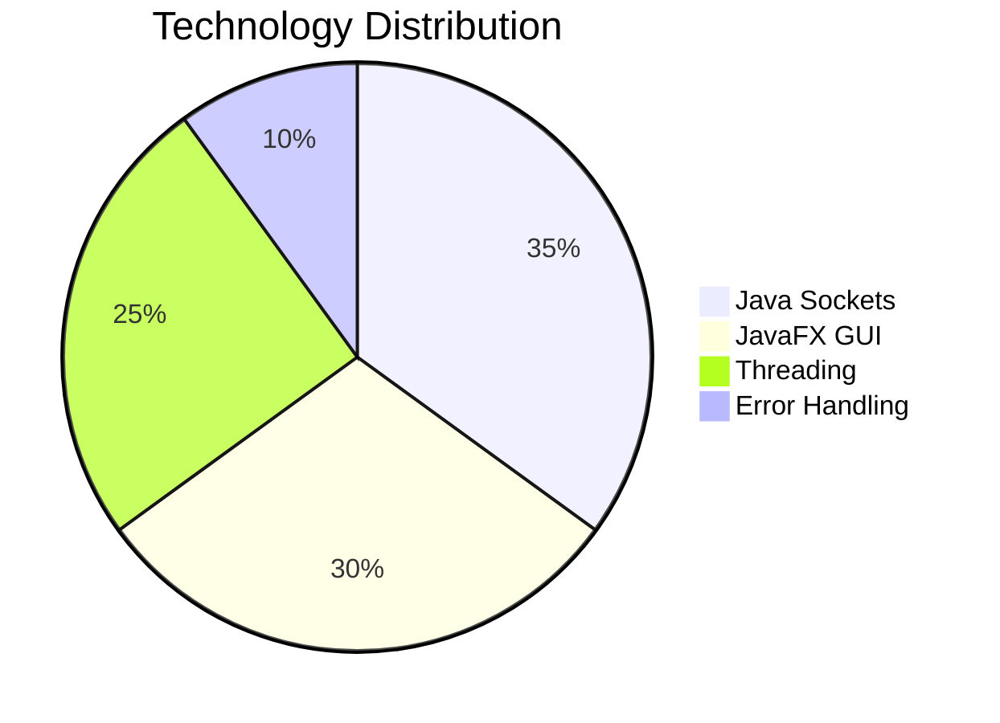
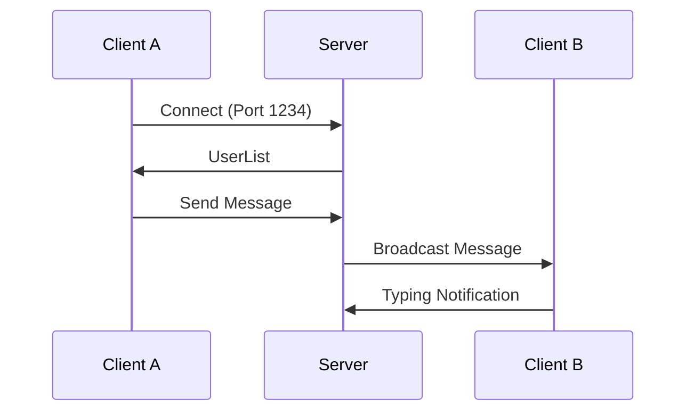

# Textly - Real-Time Multi-Client Chat Application

   

## 📌 Overview
A chat application demonstrating core networking principles with:
- **Java Sockets** for low-level communication  
- **JavaFX** for modern GUI  
- **Thread-per-client** architecture for scalability  

## ✨ Features
| Category        | Implementation Details |
|-----------------|-----------------------|
| **Messaging**   | Real-time broadcast |
| **Concurrency** | Supports 10+ concurrent users via thread isolation |
| **GUI**         | Color-coded messages (User/Server/System), Dynamic user list |
| **Stability**   | Graceful disconnection handling, Input validation |

## 🛠 Tech Stack

**Screenshot :**

### 🚀 Installation
- JDK 17+
- JavaFX 19 SDK

🔗 Connect: [GitHub](https://github.com/aslams2020) | [LinkedIn](https://www.linkedin.com/in/aslamsayyad02/)  
📧 Contact: sayyadaslam2020@gmail.com
